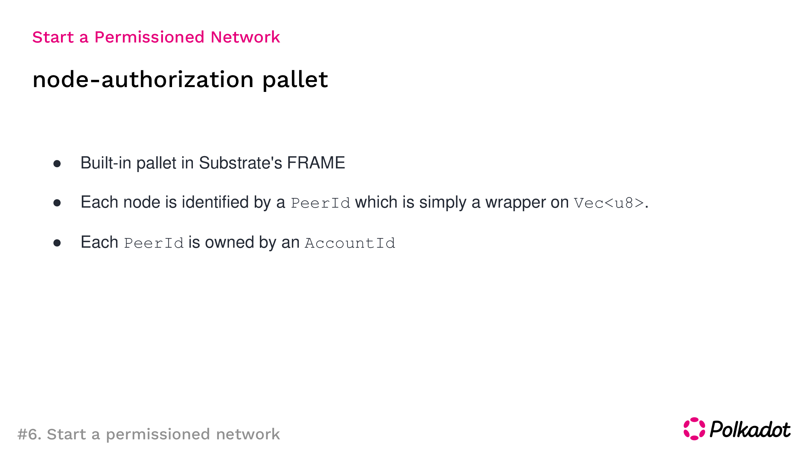

# 6_permissioned-network
In this tutorial, you will learn how to build a permissioned network with Substrate by using the node-authorization pallet.

**Collaborators** : [Myungha Cho](https://github.com/chomyungha51) [Chaerin Kim](https://github.com/decentra1ized) [Hyemin Kim]()

## Materials

